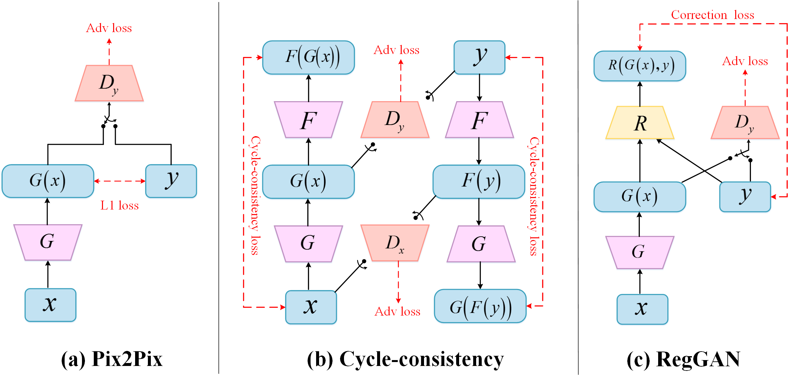

# Breaking the Dilemma of Medical Image-to-image Translation


Get the full paper on [Arxiv](https://arxiv.org/pdf/2110.06465.pdf).
This paper has been accepted by [NeurIPS 2021 (Spotlight)](https://openreview.net/forum?id=C0GmZH2RnVR&referrer=%5BAuthor%20Console%5D(%2Fgroup%3Fid%3DNeurIPS.cc%2F2021%2FConference%2FAuthors%23your-submissions)).

## Main Reference Environment
1. Linux         (Titan RTX)
2. Python        (3.6.6)
3. torch         (1.9.0+cu111)
5. visdom        (0.1.8.9)
6. numpy         (1.19.2)
7. skimage       (0.15.0)
8. Yaml          (5.4.1)
9. cv2           (3.4.2)
10. PIL          (8.3.2)

## Usage
1. Create dataset
   -  train path/A/
   -  train path/B/
   -  val path/A/
   -  val path/B/ 
2. The default data file form is .npy and normalized to [-1,1].
3. Modify the parameters in the .yaml file as needed:
   -  **bidirect**: whether to use bidirectional network, corresponding to the C or NC mode in the paper.
   -  **regist**: whether the registration network is used, corresponding to the +R mode in the paper.
   - **noise_level**: set to 0 if you do not want to use noise.
   - **port**: port parameters of visdom.
4. Default RegGAN mode (bidirect:**False**    regist:**True**).
5. Start visdom：
 ```
python -m visdom.server -p 6019
```
If other port parameters are used, you need to modify the port in yaml.

6. Train:
 ```
python train.py
```
## Trained Weights
We provide Pix2pix, CycleGAN, RegGAN trained weights under the condition of Noise.0:
https://drive.google.com/file/d/1xWXB9u6dQ9ZytmgQl_0ph4H_Ivtd41zJ/view?usp=sharing
-  Pix2pix_noise0
-  CycleGAN_noise0
-  RegGAN_noise0

## Processed data
We provide some processed data for your convenience：
https://drive.google.com/file/d/1PiTzGQEVV7NO4nPaHeQv61WgDxoD76nL/view?usp=sharing


## Citation

If you find RegGAN useful in your research, please consider citing:

```
@inproceedings{
kong2021breaking,
title={Breaking the Dilemma of Medical Image-to-image Translation},
author={Lingke Kong and Chenyu Lian and Detian Huang and ZhenJiang Li and Yanle Hu and Qichao Zhou},
booktitle={Thirty-Fifth Conference on Neural Information Processing Systems},
year={2021},
url={https://openreview.net/forum?id=C0GmZH2RnVR}
}
```
